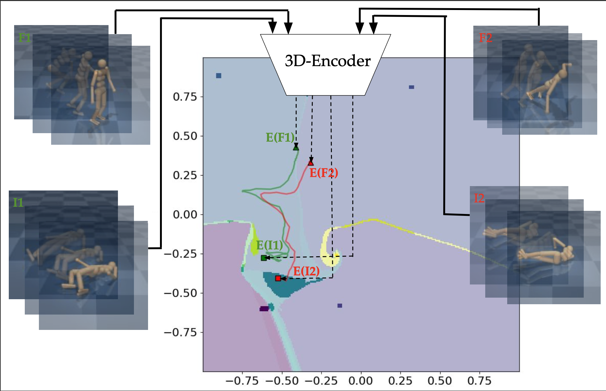

<h1 align="center">
V-MORALS: Visual Morse Graph-Aided Estimation of Regions of Attraction in a Learned Latent Space
</h1>

  <a href="https://www.linkedin.com/in/faiz-aladin/">Faiz Aladin</a> &nbsp;•&nbsp;
  <a href="https://www.linkedin.com/in/balasubramanian-ashwin/">Ashwin Balasubramanian</a> &nbsp;•&nbsp;
  <a href="https://sites.google.com/view/larslindemann/main-page">Lars Lindemann</a> &nbsp;•&nbsp;
  <a href="https://danielseita.github.io/">Daniel Seita</a>

2026 IEEE International Conference on Robotics and Automation (ICRA)

<h4 align="center">
  <a href="https://v-morals.onrender.com"><b>Website</b></a> &nbsp;•&nbsp;
  <a>Paper</a>
</h4>

## About:
V-MORALS takes in a dataset of image-based trajectories of a system under a given controller, and defines a learned latent space for reachability analysis. Using the learned latent space, our method is able to generate well-defined Morse graphs and ROAs for various systems.

## How to Use:
1. Install the following dependencies:
<pre>pip install -r requirements.txt</pre>

2. You can download the image datasets for Humanoid, CartPole, Pendulum, and Acrobot from this google drive link: https://drive.google.com/drive/folders/1uFWEM2_Syk_t_tilIXgDLRsMLdPdOIcX?usp=sharing
3. Move the image dataset to the folder of the system you want to use. 

4. To generate models for a given system, move to that folder and run (you can also skip this step and use the existing models):
<pre>cd humanoid 
python train.py 
</pre>

5. To generate the Morse Graph and Regions of Attraction Map run:
<pre>python get_MG_ROA_{model_latent_dim}.py
</pre>

6. If you dataset is sparse or has few trajectories you can directly sample from the latent space by running:
<pre>python get_MG_ROA_random.py
</pre>

## Custom Dataset:
1. Copy the files from any of the system folders.
2. Change the models.py to adapt to your image size and the number of images you want to stack.
3. Change the {system}_dataloader.py file to use your own datset and success.txt file
4. Repeat the steps in "How to Use".

## Citation:
<pre>
@inproceedings{aladin2026vmorals,
  title={{V-MORALS: Visual Morse Graph-Aided Discovery of Regions of Attraction in a Learned Space}},
  author={Faiz Aladin and Ashwin Balasubramanian and Lars Lindemann and Daniel Seita},
  booktitle={International Conference on Robotics and Automation (ICRA)},
  Year={2026}
}
</pre>

